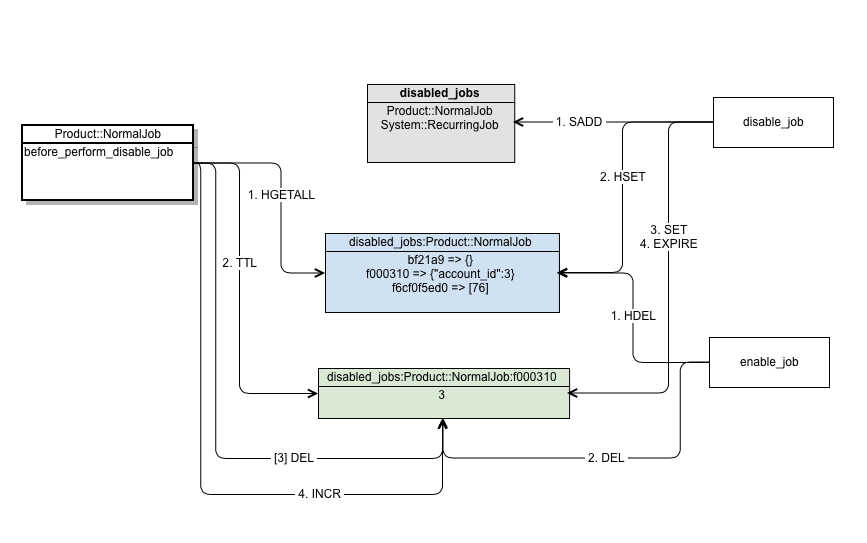

# Resque Disable Job

**Version 0.1**

## Summary

This is a Resque plugin that allows us to disable jobs from being processed, by using the job class name and some parameters.
It uses some Redis data structures to keep a record of what jobs need to be disabled and how many jobs were disabled for that setting.
Design


## Data Structures

The diagram below shows the data structures used by the main operations of the plugin: 


The `disabled_jobs` set that contains the job class name so we can keep track on what jobs are disabled by their name.

We store in the `disabled_jobs:<JobName>` hash the arguments we want to block for that job. The key is going to be a digest of the arguments.

With that digest we set counter that expires `disabled_jobs:<JobName>:<digest>`. We increment this when we block a job based on those settings (name and arguments). We check if this is expired before blocking. This way we can make sure we don't forget this setting and we are blocking the job for a long time.

## Operations

### Marking a job as disabled
We can disable a job just by it's name, or name and some parameters:

```ruby
# disable the job for all the arguments
JobName.disable
# disable a job only for specific arguments
JobName.disable([5, 15])
SampleJob.disable({a: 5})

# we can also set a timeout for a rule (the default is 1 hour)
SampleJob.disable({a: 1}, 60)
```

### Matching logic
We match the arguments from left to right and from specific to generic. If you don't specify an argument, the plugin assumes you want to match on all possible values.
Example

The setting `[]` will match any arguments as array, like `[4]`, `[4, 'message']`.
The setting `[20, 134]` will match `[20, 134, [134]]` but not `[20, 135]`.
For hash arguments the rules are the same except for the order requirements.

### Checking if we should process

Once the plugin is included, a before_perform hook is setup and it will run the check before it performs.
The check looks at the `disabled_jobs:<JobName>` hash for all the settings. We check if any of the arguments set match the current job's arguments.

The arguments matcher will handle arrays or hashes and will match part of the arguments from the most generic (an empty [] or {}) to the most specific like all the job's parameters.

### Enable a job

We can enable a job just by it's name, or name and some parameters:

```ruby
TestJob.enable()
TestJob.enable([65])

# Simple kill-switch to remove all the rules for the job
TestJob.enable_all

# Kill-switch to remove all the jobs and their rules
Resque::Plugins::DisableJob::Job.enable_all!
```

### Stats

The `Resque::Plugins::DisableJob::Stats` module comes with a a few methods that will help you keep track of actively disabled jobs and how many times the rule was matched.
 
* `all_disabled_jobs` - returns a hash of all the disabled jobs and their rules 
* `job_disabled_rules(job_name)` - returns a hash of all the rules for one particular job 
* `disabled_stats` - returns an array of all the disabled jobs, their rules, and the counter of how many times it was matched 
